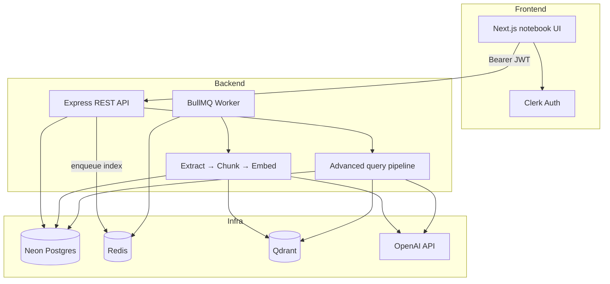

# ThoughtStack

NotebookLM-style RAG app: isolated notebooks, multi-source ingest, and an advanced query pipeline (step-back, rewrite, sub-queries, HyDE, multi-vector search, RRF, grade-and-retry).

## Stack

| Layer | Choice |
| --- | --- |
| Frontend | Next.js (App Router) + Tailwind + Clerk |
| Backend | Express + TypeScript |
| DB | Prisma + Neon (serverless Postgres) |
| Vector DB | Qdrant |
| Queue | BullMQ + Redis |
| RAG | LangChain.js + OpenAI embeddings / `gpt-4o-mini` |

Apps are **separate packages** (no monorepo tooling). Install and run each independently.

```
ThoughtStack/
├── frontend/           # Next.js UI (Clerk)
├── backend/            # Express API + BullMQ worker
├── Caddyfile           # HTTPS reverse proxy for the API
├── docker-compose.yml  # redis + qdrant + api + worker + caddy
└── README.md
```


## Prerequisites

- Node.js 20+
- Docker Desktop (for Redis + Qdrant)
- [Neon](https://neon.tech) project (Postgres connection strings)
- [Clerk](https://clerk.com) application (publishable + secret keys)
- OpenAI API key

## Quick start

### 1. Infra (Redis + Qdrant)

From the repo root:

```bash
docker compose up -d
```

- Redis: `localhost:6379`
- Qdrant: `http://localhost:6333`

Neon is cloud-only — no Postgres container.

### 2. Backend

```bash
cd backend
cp .env.example .env
# Fill DATABASE_URL, DIRECT_URL, Clerk keys, OPENAI_API_KEY, etc.
npm install --legacy-peer-deps
npx prisma migrate dev
npm run dev
```

API defaults to **http://localhost:4000**.

In a second terminal, start the indexing worker:

```bash
cd backend
npm run worker
```

| Script | Purpose |
| --- | --- |
| `npm run dev` | API with `tsx watch` |
| `npm run worker` | BullMQ `source-index` worker |
| `npm run prisma:migrate` | Run migrations against Neon |
| `npm run prisma:generate` | Regenerate Prisma client |

Health check: `GET /health` (API + Neon + Qdrant).

### 3. Frontend

```bash
cd frontend
cp .env.example .env.local
# Set NEXT_PUBLIC_CLERK_PUBLISHABLE_KEY, CLERK_SECRET_KEY, NEXT_PUBLIC_API_URL
npm install
npm run dev
```

App defaults to **http://localhost:3000**.

- `/` — landing + Clerk sign-in/up
- `/sign-in`, `/sign-up` — Clerk components
- `/notebooks` — notebook list (protected)
- `/notebooks/[id]` — workspace: sources + chat + source viewers

`NEXT_PUBLIC_API_URL` should point at the Express API (e.g. `http://localhost:4000`).

## Env vars

Copy the example files and fill in real values:

- `backend/.env.example` → `backend/.env`
- `frontend/.env.example` → `frontend/.env.local`

### `backend/.env`

| Variable | Notes |
| --- | --- |
| `PORT` | API port (default `4000`) |
| `DATABASE_URL` | Neon **pooled** connection string |
| `DIRECT_URL` | Neon **direct** URL for Prisma migrate |
| `REDIS_URL` | `redis://localhost:6379` |
| `QDRANT_URL` | `http://localhost:6333` |
| `OPENAI_API_KEY` | Embeddings + LLM |
| `CLERK_PUBLISHABLE_KEY` / `CLERK_SECRET_KEY` | Backend JWT verify |
| `CORS_ORIGIN` | Frontend origin (`http://localhost:3000`) |
| `SUPABASE_URL` | Supabase project URL |
| `SUPABASE_SERVICE_ROLE_KEY` | Service role key (server-only) |
| `SUPABASE_STORAGE_BUCKET` | Storage bucket name (default `sources`) |

### `frontend/.env.local`

| Variable | Notes |
| --- | --- |
| `NEXT_PUBLIC_CLERK_PUBLISHABLE_KEY` | Clerk publishable key |
| `CLERK_SECRET_KEY` | Clerk secret (Next middleware) |
| `NEXT_PUBLIC_API_URL` | Express base URL |
| `NEXT_PUBLIC_CLERK_SIGN_IN_URL` | `/sign-in` |
| `NEXT_PUBLIC_CLERK_SIGN_UP_URL` | `/sign-up` |

## Architecture



**Isolation:** every Qdrant point stores `notebookId` + `sourceId`; searches always filter by `notebookId`.

**Two pipelines:**

1. **Ingest** — document → extract → chunk → embed → Qdrant (+ Chunk rows in Neon)
2. **Query** — plan/rewrite/sub-queries + HyDE → multi-vector search → RRF (top 5) → grounded answer → grade/retry (max 3)

## Submission limits

| Limit | Value |
| --- | --- |
| Max upload size | **20 MB** (PDF / TEXT / VTT) |
| Max sources per notebook | **25** |
| Source write rate | 30 / minute / client |
| Query rate | 10 / minute / client |

Oversized files are rejected in the UI before upload and by Multer on the API (`413` with a clear error).

## Demo script

Use this walkthrough for a grading / assignment demo (about 5–8 minutes).

1. **Start infra + apps**
   - `docker compose up -d`
   - Backend: `npm run dev` and `npm run worker`
   - Frontend: `npm run dev`
2. **Sign in** at http://localhost:3000 with Clerk.
3. **Create a notebook** on `/notebooks` (e.g. “Demo notes”).
4. **Add sources** in the workspace:
   - Upload a `.txt` or `.pdf` (under 20 MB)
   - Optionally add a website URL and/or YouTube URL with captions
   - Watch status badges: Uploading → Indexing → **Ready** (polls every ~2.5s)
5. **Ask a question** once at least one source is Ready.
   - The Ask button stays disabled until a Ready source exists.
   - Wait for the graded answer (may take several seconds — multi-step RAG).
6. **Citations**
   - Every assistant answer shows citation chips under the message.
   - Click a chip → source viewer opens at the relevant locus (PDF page, YouTube timestamp, text highlight, website preview).
7. **Failure / retry**
   - If indexing fails, the source shows an error and a **Retry** action.
8. **Cleanup**
   - Delete a source or notebook via the confirm dialog (cascade removes DB rows + Qdrant points).

Optional talking points while demos run:

- Query path uses step-back + rewrite + sub-queries (one structured LLM call), HyDE, parallel dense search, RRF fusion, grounded answer, grader score /10 with up to 3 attempts.
- Chat shows grade + attempt count under assistant messages for debugging.

## Deploy API with HTTPS (Caddy)

Vercel (HTTPS) cannot call a plain `http://IP:4000` API (mixed content). Use Caddy in Compose for Let’s Encrypt TLS.

1. Point a DNS **A** record (e.g. `api.yourdomain.com`) at your VPS. Open ports **80** and **443**.
2. On the server, create root `.env` (see `.env.example`):

```bash
cp .env.example .env
# API_DOMAIN=api.yourdomain.com
# ACME_EMAIL=you@example.com
```

3. Set `backend/.env` with production values, especially:

```env
CORS_ORIGIN=https://thought-stack-ai.vercel.app
```

4. Start the stack **with the HTTPS profile** (enables Caddy):

```bash
docker compose pull
docker compose --profile https up -d
docker compose logs -f caddy
```

5. Check `https://api.yourdomain.com/health`.

6. On Vercel, set `NEXT_PUBLIC_API_URL=https://api.yourdomain.com` and redeploy the frontend.

## Notes

- Source files (PDF / TEXT / VTT / YouTube transcripts) are stored in Supabase Storage.
- Install backend deps with `--legacy-peer-deps` if npm reports LangChain optional-peer conflicts (an `.npmrc` is included).
- Run `npx prisma migrate dev` only after `DATABASE_URL` / `DIRECT_URL` point at a real Neon database.
- Frontend `README.md` is the stock Next.js file; use this root README for product setup.
- Production HTTPS: `docker compose --profile https up -d` (needs root `.env` with `API_DOMAIN` + `ACME_EMAIL`).
