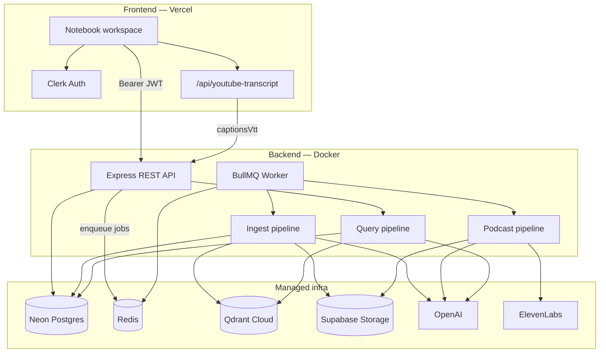
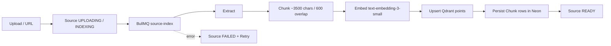
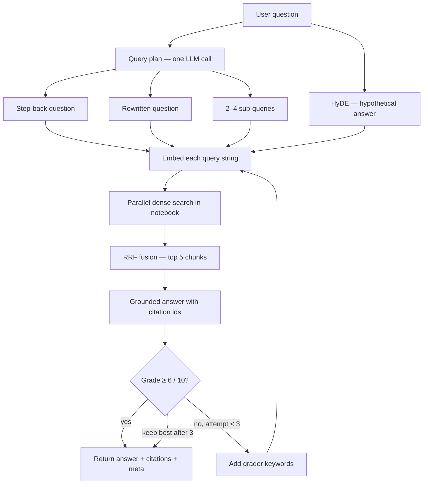
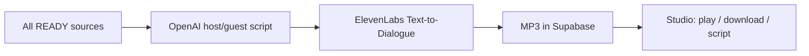

# ThoughtStack

NotebookLM-style RAG workspace: **isolated notebooks**, multi-source ingest, grounded chat with citations, source viewers, and **host/guest podcast generation**.

**Live demo:** [https://thought-stack-ai.vercel.app/](https://thought-stack-ai.vercel.app/)

---

## Features

| Area | What you get |
| --- | --- |
| **Notebooks** | Create, rename, delete; each notebook is its own knowledge base |
| **Sources** | PDF, TEXT (`.txt`/`.md`), Website, YouTube (captions), VTT |
| **Ingest** | Async extract → chunk → embed → Qdrant; status badges + retry |
| **Chat** | Advanced RAG answers with citation chips and grade/attempt metadata |
| **Viewers** | Jump to PDF page, YouTube timestamp, text/VTT highlight, website preview |
| **Studio** | Generate a ~5 min host/guest podcast (ElevenLabs) from READY sources |
| **Auth** | Clerk sign-in/up; API protected with Bearer JWT |

### Workspace (`/notebooks/[id]`)

1. **Sources** — upload files or add URLs; poll Uploading → Indexing → Ready / Failed  
2. **Studio** — generate / play / download podcasts; view dialogue script  
3. **Chat** — ask once ≥1 source is Ready; click citations to open the locus  

---

## Stack

| Layer | Choice |
| --- | --- |
| Frontend | Next.js (App Router) + Tailwind + Clerk |
| Backend | Express + TypeScript + BullMQ worker |
| DB | Prisma + Neon (Postgres) |
| Object storage | Supabase Storage (sources + podcast MP3s) |
| Vector DB | Qdrant Cloud (`text-embedding-3-small`, 1536-dim) |
| Queue | Redis + BullMQ |
| LLM / embeddings | OpenAI (`gpt-4o-mini`, `text-embedding-3-small`) |
| Podcast TTS | ElevenLabs Text-to-Dialogue (host + guest voices) |
| Deploy | Frontend on Vercel; API via Docker + optional Caddy HTTPS |

Apps are **separate packages** (no monorepo tooling).

```
ThoughtStack/
├── frontend/            # Next.js UI (Clerk)
├── backend/             # Express API + BullMQ worker
│   ├── prisma/
│   └── src/
│       ├── routes/      # notebooks, sources, query, podcasts
│       ├── services/    # ingest, queryPipeline, podcast*, extractors
│       ├── queues/      # source-index, podcast-generate
│       └── worker.ts
├── Caddyfile            # HTTPS reverse proxy (profile: https)
├── docker-compose.yml   # redis + api + worker (+ caddy)
└── README.md
```

---

## Architecture



**Isolation:** every Qdrant point stores `notebookId` + `sourceId`. Searches always filter by `notebookId`, so notebooks never share a knowledge base.

**Three pipelines:**

1. **Ingest** — extract → chunk → embed → Qdrant (+ Chunk rows in Neon)  
2. **Query** — plan + HyDE → multi-vector search → RRF → grounded answer → grade/retry  
3. **Podcast** — READY sources → host/guest script → ElevenLabs TTS → MP3 in Supabase  

---

## Ingest / embedding pipeline

Sources are indexed asynchronously so uploads return immediately and the UI polls status.



| Step | Detail |
| --- | --- |
| Extract | PDF / text / website (Readability) / YouTube captions / VTT |
| Chunk | LangChain `RecursiveCharacterTextSplitter` (~800–1000 tokens) |
| Embed | OpenAI `text-embedding-3-small` (1536 dims, cosine) |
| Store | Qdrant payload: `notebookId`, `sourceId`, `chunkId`, text, locator |
| Locators | page / char range / startMs–endMs / url — used by citation viewers |
| Reindex | Deletes prior vectors + chunks for that source, then re-runs |

**YouTube note:** caption fetches from cloud IPs are often blocked, so the frontend fetches transcripts (Next route) and sends them with the URL source when needed.

---

## Query pipeline

Chat uses an advanced retrieval stack, not a single embedding of the raw question.



| Step | Purpose |
| --- | --- |
| **Step-back** | Broader framing for better retrieval |
| **Rewrite** | Clearer, search-friendly phrasing |
| **Sub-queries** | Cover distinct facets of the question |
| **HyDE** | Embed a short hypothetical answer (retrieval only) |
| **Multi-vector search** | Dense search per query, filtered by `notebookId` |
| **RRF** | Fuse ranked lists (`k=60`) → top **5** chunks |
| **Grounded answer** | `gpt-4o-mini` must cite chunks as `[n]` |
| **Grade + retry** | Score /10; pass ≥6; else retry with keywords (max **3**); keep best |

UI shows `Grade X/10 · attempt N` under assistant messages for debugging.

---

## Podcast pipeline



- Host = male voice, guest = female voice (configurable voice IDs)  
- Spoken length capped at **~5 minutes**; max **5** podcasts per notebook  
- One generation in flight per notebook  

---

## Engineering decisions

| Decision | Why |
| --- | --- |
| **Separate frontend / backend packages** | Clear deploy boundaries (Vercel vs Docker); no monorepo tooling overhead for this assignment size |
| **Notebook-scoped Qdrant filters** | Hard isolation without one collection per notebook |
| **BullMQ for ingest + podcasts** | Long-running work off the request path; retries and concurrency controls |
| **Supabase Storage (not local disk)** | API/worker containers stay ephemeral; same files work across deploys |
| **Qdrant Cloud** | No vector DB container to operate; stable URL + API key |
| **Advanced query stack (plan / HyDE / RRF / grade)** | Better recall and answer quality than single-query RAG; grader loop reduces weak answers |
| **Custom RRF helper** | Simple, transparent fusion over parallel hit lists |
| **Citation locators in Chunk JSON** | Viewers can open the exact page / timestamp / highlight without re-parsing |
| **YouTube captions via frontend** | Avoids datacenter IP blocks on the VPS |
| **Clerk JWT on every API call** | Same identity on FE and BE; users upserted on first authenticated request |
| **In-memory rate limits** | Cheap guardrails for demo traffic (per IP + auth) |
| **Caddy `https` Compose profile** | Optional Let’s Encrypt TLS so Vercel (HTTPS) can call the API without mixed content |
| **Prisma 6 + migrate deploy in entrypoint** | Schema stays in sync when containers start |

---

## Limits

| Limit | Value |
| --- | --- |
| Max upload size | **20 MB** (PDF / TEXT / VTT) |
| Max sources per notebook | **25** |
| Max podcasts per notebook | **5** |
| Max podcast duration | **~5 minutes** |
| Source write rate | 30 / minute / client |
| Query rate | 10 / minute / client |
| Podcast write rate | 5 / minute / client |

---

## Prerequisites

- Node.js 20+
- Docker (Redis + optional full API stack / Caddy)
- [Neon](https://neon.tech) Postgres
- [Qdrant Cloud](https://cloud.qdrant.io)
- [Clerk](https://clerk.com)
- OpenAI API key
- [Supabase](https://supabase.com) project (Storage bucket)
- [ElevenLabs](https://elevenlabs.io) API key (podcasts)

---

## Quick start

### 1. Redis

```bash
docker compose up -d redis
```

- Redis: `localhost:6379`  
- Neon, Qdrant, and Supabase are cloud services (no local containers).

### 2. Backend

```bash
cd backend
cp .env.example .env
# Fill DATABASE_URL, DIRECT_URL, QDRANT_*, Clerk, OpenAI, Supabase, ElevenLabs
npm install --legacy-peer-deps
npx prisma migrate dev
npm run dev
```

Second terminal — worker (indexing + podcasts):

```bash
cd backend
npm run worker
```

| Script | Purpose |
| --- | --- |
| `npm run dev` | API with `tsx watch` |
| `npm run worker` | BullMQ `source-index` + `podcast-generate` |
| `npm run prisma:migrate` | Migrate against Neon |
| `npm run prisma:generate` | Regenerate Prisma client |

Health: `GET http://localhost:4000/health`

### 3. Frontend

```bash
cd frontend
cp .env.example .env.local
# Clerk keys + NEXT_PUBLIC_API_URL=http://localhost:4000
npm install
npm run dev
```

| Route | Purpose |
| --- | --- |
| `/` | Landing + auth |
| `/sign-in`, `/sign-up` | Clerk |
| `/notebooks` | Notebook list |
| `/notebooks/[id]` | Sources + Studio + Chat + viewers |

### Full stack in Docker

```bash
# From repo root — builds/runs api + worker + redis
docker compose up -d --build
```

---

## Env vars

### `backend/.env`

| Variable | Notes |
| --- | --- |
| `PORT` | Default `4000` |
| `DATABASE_URL` | Neon **pooled** URL |
| `DIRECT_URL` | Neon **direct** URL (migrations) |
| `REDIS_URL` | `redis://localhost:6379` |
| `QDRANT_URL` / `QDRANT_API_KEY` | Qdrant Cloud |
| `OPENAI_API_KEY` | Embeddings + LLM |
| `CLERK_PUBLISHABLE_KEY` / `CLERK_SECRET_KEY` | JWT verify |
| `CORS_ORIGIN` | Comma-separated FE origins |
| `SUPABASE_URL` / `SUPABASE_SERVICE_ROLE_KEY` | Storage (server-only) |
| `SUPABASE_STORAGE_BUCKET` | Default `sources` |
| `ELEVENLABS_API_KEY` | Podcast TTS |
| `ELEVENLABS_HOST_VOICE_ID` / `ELEVENLABS_GUEST_VOICE_ID` | Host / guest voices |

### `frontend/.env.local`

| Variable | Notes |
| --- | --- |
| `NEXT_PUBLIC_CLERK_PUBLISHABLE_KEY` | Clerk publishable |
| `CLERK_SECRET_KEY` | Clerk secret (middleware) |
| `NEXT_PUBLIC_API_URL` | Express base URL |
| `NEXT_PUBLIC_CLERK_SIGN_IN_URL` | `/sign-in` |
| `NEXT_PUBLIC_CLERK_SIGN_UP_URL` | `/sign-up` |

---

## Deploy API with HTTPS (Caddy)

Vercel is HTTPS, so the API must be HTTPS too (no `http://IP:4000` — mixed content).

1. DNS **A** record for `api.yourdomain.com` → VPS; open **80** + **443**.
2. Root `.env` (see `.env.example`):

```env
API_DOMAIN=api.yourdomain.com
ACME_EMAIL=you@example.com
CORS_ORIGIN=https://thought-stack-ai.vercel.app
```

3. `backend/.env` with production secrets; `CORS_ORIGIN` matching Vercel.
4. Start with the HTTPS profile:

```bash
docker compose pull
docker compose --profile https up -d
docker compose logs -f caddy
```

5. Check `https://api.yourdomain.com/health`.
6. Vercel: `NEXT_PUBLIC_API_URL=https://api.yourdomain.com` → redeploy.

Locally use `docker compose up -d` **without** `--profile https` (no domain / certs needed).

---

## Notes

- Source binaries and podcast MP3s live in **Supabase Storage**.
- Backend install may need `--legacy-peer-deps` (`.npmrc` sets this).
- Run Prisma migrate only after Neon URLs are set.
- Production HTTPS: `docker compose --profile https up -d`.
